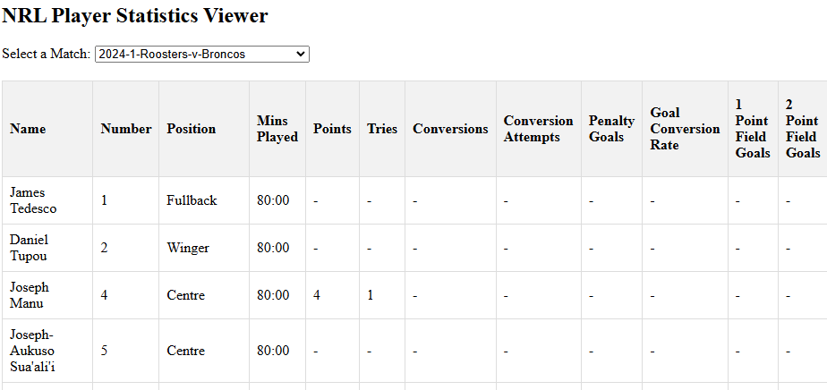

# Scrapers

## Overview
This script fetches and saves NRL player statistics per round for a selected year. It is optimized for fast execution using a persistent Selenium WebDriver.

## Usage

### Running the Data Downloader
Execute the following command from the `scraping` directory:
```bash
python downloader.py
```
> You must specific the selection and years

### Running the Web Scraper
Execute the following command from the `scraping` directory:
```bash
python run.py
```
> You must specific the selection and years

### HTML Web Viewer
Open the HTML file in html_interfaces to use the interactive website viewer. It looks like the following:


### Script Functionality
1. **Loads Match Data**
   - Reads `nrl_data_YEAR.json` containing match details.
   - Extracts match information (teams, round, and year).

2. **Scrapes Player Statistics**
   - Uses Selenium WebDriver to navigate to match pages.
   - Extracts player statistics using BeautifulSoup.
   - Stores match and player data in JSON format.

3. **Saves Data**
   - Writes to `player_statistics_YEAR.json` after each round.
   - Ensures data is saved incrementally to prevent loss.

## Output Files
- `data/{selected type}/{selected year}/{selected type}_data_YEAR.json`: Raw match data.
- `data/{selected type}/{selected year}/{selected type}_player_statistics_YEAR.json`: Player statistics structured as:
  ```json
  {
      "PlayerStats": [
          {
              "YEAR": [
                  {
                      "Round": [
                          { "Match": [{"Player Name": "Stats"}] }
                      ]
                  }
              ]
          }
      ]
  }
  ```

## Machine Learning & Prediction Pipeline

### Overview
The project includes a full pipeline for collecting, validating, repairing, and transforming NRL data for use in machine learning models and match outcome prediction. The pipeline is orchestrated by `run.py` and includes the following steps:

1. **Fetch Official Team Lists**
   - `fetch_upcoming_teamlists.py` scrapes the latest official NRL team lists from the NRL website every Wednesday and saves them as structured JSON for use in predictions.

2. **Scrape Match, Player, and Detailed Data**
   - `nrl_data_main/scraping/run.py` orchestrates scraping of match data, detailed match stats, and player statistics for all selected years and rounds.

3. **Data Validation & Repair**
   - `validate_titan_json_structure.py` checks the integrity and schema of all output JSON files.
   - `repair_titan_json.py` fixes malformed or inconsistent JSON files and saves them to a separate directory.

4. **Data Flattening & Transformation**
   - `flatten_nrl_data.py` and `rebuild_detailed_match_data.py` convert nested JSONs into flat, analysis-ready formats (CSV/JSON).

5. **Machine Learning & Prediction**
   - `new_prediction_models/predictor_ml.py` loads the processed data, builds features, and runs machine learning models to predict match outcomes, player performance, or other targets.
   - Outputs predictions to the `outputs/` directory for further analysis or reporting.

### Running the Full Pipeline
Run the master pipeline from the root directory:
```bash
python run.py
```
This will:
- Fetch the latest team lists
- Scrape all required data
- Validate and repair data
- Flatten and transform data
- Run the machine learning prediction models

### Output Files
- `outputs/NRL_teamlists_YYYY-MM-DD.json`: Official team lists for the upcoming round
- `outputs/*.csv` and `outputs/*.json`: Flattened and processed data for ML
- `outputs/predictions_*.csv`: Model predictions for matches/players

### Notes
- Ensure all dependencies in `requirements.txt` are installed.
- The pipeline is modular; each step can be run independently if needed.
- Update parameters (years, rounds, comp type) in `run.py` as required.
- For troubleshooting, check logs and output files for each step.

## Notes
- Ensure `chromedriver` is properly configured.
- Modify `selected_year` and `selected_rounds` in script to adjust the range.
- The script may require updates if the NRL website structure changes.

For any issues, refer to console logs for debugging.


